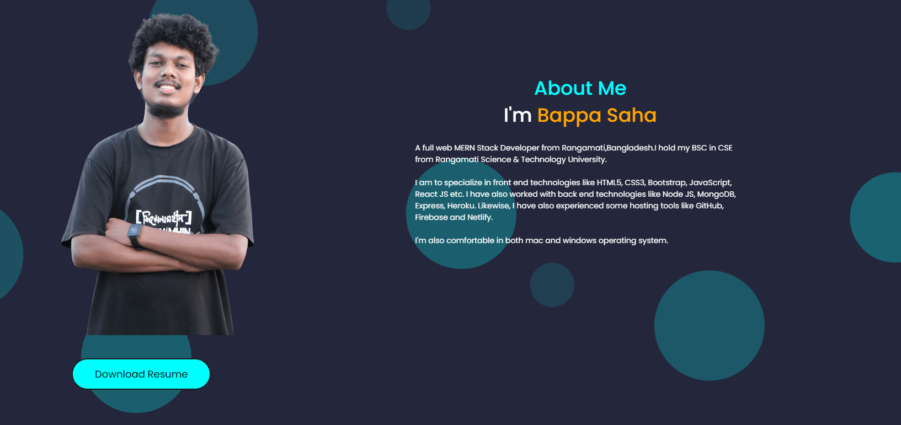

  
  
  | 
  <a href="https://docs.google.com/spreadsheets/d/1MBXwR8tweXomw-iDjiiWFAZovhVCEC7w_asXQzT0pYE/edit?gid=2003874262#gid=2003874262" target="_blank">
    🏆 𝑳𝒆𝒂𝒓𝒏𝒊𝒏𝒈 𝑹𝒐𝒂𝒅𝒎𝒂𝒑
  </a>

[📩 Email](bappasaha161@gmail.com) | [🌐 Portfolio](https://bappasahabapi.vercel.app/) | [✨Blog-Site](https://dev.to/bappasahabapi) | [👨🏻‍💼 Linkedin](https://www.linkedin.com/in/bappasaha/)

**Software Engineer | Web Developer | Tech Enthusiast**

<b>[👉 🔍 Search Projects From My Github with source code](https://github.com/bappasahabapi/Projects-Links)</b>

<!-- 
<strong align="center"> <a align="center" href="https://bappa-saha.web.app" target="_blank"  rel="noopener noreferrer">𝐏𝐨𝐫𝐭𝐟𝐨𝐥𝐢𝐨 </a></strong> || <strong align="center">  
<a  align="center" href="https://drive.google.com/file/d/1ESQYoqqj6ewqmSbYsXpRyO0CsXa3y5BD/view"  rel="noopener noreferrer" >📜 𝐑𝐞𝐬𝐮𝐦𝐞</a>
</strong> -->

<!-- 
🦸🏿‍♂️ -->

<!--    -->

<!--   -->

<!-- ## [👉🎡 Search Projects From My Github with source code](https://github.com/bappasahabapi/Projects-Links) -->

**Hello,**  
I am **Bappa Saha**, currently working as a **Software Engineer** at [Blue Flower Media](https://www.blueflowermedia.com/). and ex-employee of  [Spectrum Engineering Consortium (Pvt.) Ltd.](https://www.spectrum-bd.com/). I specialize in developing and maintaining software solutions, collaborating with cross-functional teams to deliver high-quality products for small and medium-sized enterprises. 

Additionally, I serve as an **ICT Instructor** at [বন্দি পাঠশালা](https://www.bondipathshala.com.bd) and **Content Creator** on [YouTube](https://youtu.be/FW3_1evyZXs?si=NVyvL141QgdWWR9e). I've completed my undergrad on Computer Science & Engineering at [RMSTU](https://rmstu.ac.bd/). Besides tech I'm also fairly invested in movies, reading, playing and traveling.

> 💡 I'm open to new opportunities in the domain of frontend engineering, systems, and micro-services.

### 🪴 My Tech! 
- **Languages** - `C++`  `Go` `Javascript` `TypeScript` `SQL` 
- **Backend** - `Node.js` `Express.js` `Gin`
- **Frontend** - `React js Nextjs`  `Redux`
- **Database** - `PostgreSQL`  `MongoDB`
- **Tools** - `Git` 
- **Testing** - `Cypress` `Postman`
- **Infra** - `Docker` `Linux`
- **Documentation** - `Swagger OAS` `Readme.md`

## 👨‍💻 Working Experience

| Role | Company | Duration | Description |
|------|---------|----------|-------------|
| **Software Engineer:L-1** | [Blue Flower Media](https://blueflowermedia.com) | *Dec,2024 – Present* | - Develop software solutions for SMEs - Collaborate with cross-functional teams to deliver robust, scalable applications |
| **Software Engineer**  | [Spectrum Engineering Consortium (Pvt.) Ltd.](https://spectrum-bd.com) | *May,2022 – Oct,2024* | - Contributed to enterprise software projects - Focused on performance optimization and client support |
| **Front-End Engineer & ICT Instructor** | [বন্দি পাঠশালা](https://www.bondipathshala.education/bn) | *Aug,2020 – Mar,2022* | - Built a university management prototype using the **MERN** stack - Instructed students in ICT - Created educational content |

## <!-- ## 🎧 Competitive-Programming: -->

<!-- ### [🇧🇩Level-1-ProblemSet-Solved:](https://github.com/bappasahabapi/Level-1-ProblemSet-div-3-) -->
<!-- ###   [ 🇧🇩 URI/BeeCrowed-Online-Judge:](https://www.beecrowd.com.br/judge/en/profile/209551) -->
<!-- ### 🟡🇧🇩 HakerRank: https://www.hackerrank.com/bappasaha161 -->
<!-- ### 🟡🇧🇩 CodeForce:https://codeforces.com/profile/bappa -->

<!-- ## 🟩 ᴄᴏɴᴛᴀᴄᴛ ᴍᴇ:

  -->

### 🪴🟩 My Coding Experience

<table>
  <thead align="center">
    <tr border: none;>
      <td><b>Language</b></td>
      <td><b>Description</b></td>
      <td><b>Source link</b></td>
    </tr>
  </thead>
  <tbody>
     <tr>
      <td>🎧 Competitive-Programming</td>
      <td> Here I implemented of Basic data structure of C++ like 'Tower of hanoi, 'Searching algo','Sorting algo', Linked List and many more. Problem solving using algorithm. Online Judge solved </td>
      <td>
        <a href="https://github.com/bappasahabapi/Level-1-ProblemSet-div-3-" target="_blank"> 1. Competitive-Programming-Solving Code</a> 
        <a href="https://www.beecrowd.com.br/judge/en/profile/209551" target="_blank">2. URI/BeeCrowed-Online-Judge</a> 
        <a href="https://github.com/bappasahabapi/Level-1-ProblemSet-div-3-/tree/main/00-Algorithm" target="_blank">3. Algorithm code with c++</a> 
         <!-- <a href="https://www.hackerrank.com/bappasaha161" target="_blank"> 4. HakerRank </a> 
         <a href="https://codeforces.com/profile/bappa " target="_blank"> 5.   CodeForce </a>  -->
            <!-- HakerRank: https://www.hackerrank.com/bappasaha161 -->
         <!-- CodeForce:https://codeforces.com/profile/bappa  -->
    </td>
    </tr>
    <tr>
      <td>🔰 C Programming</></td>
      <td>Here i have uploaded my 1st semester program codes. basic C code with some mini project</td>
      <td>
<a href="https://github.com/bappasahabapi/C-programmin" target="_blank">1. C Programming</a> 
<a href="https://github.com/bappasahabapi/spl_c-program" target="_blank">2. SPL_C_program</a>
  </td>
    </tr>
    <tr>
      <td>🔰 C++ Programming</a></td>
      <td>C++ code basic , mid and STL codes</td>
      <td><a href="https://github.com/bappasahabapi/cpp_program" target="_blank">1. Cpp Code</a>  
<a href="https://github.com/bappasahabapi/STL_PROGRAMS" target="_blank">2. CPP_program</a> 
<a href="https://github.com/bappasahabapi/STL_PROGRAMS" target="_blank"> 3. STL-Programs</a>

</td>
    </tr>
    <tr>
      <td>🔰 Java Programming</td>
      <td>Code with make a student management system using java and java swing</td>
      <td><a href="https://github.com/bappasahabapi/java_netbeans" target="_blank"> 1.java_netbeans</a></td>
    </tr>
    <tr>
      <td>🔰JavaScript Programming</a></td>
      <td>Write code and many concepts of js is implemented with 10+ dom projects</td>
      <td>
        <a href="https://github.com/bappasahabapi/javaScript-problemSolving" target="_blank">1.JavaScript-problemSolving</a> 
<!--         <a href="https://github.com/bappasahabapi/JavaScript-A-Z" target="_blank">2. JavaScript A-Z</a>  -->
        <!-- <a href="https://github.com/sudheerj/javascript-interview-questions" target="_blank">Interview JavaScript:</a>  -->
    </td>
    </tr>
    <tr>
      <td>🔰 Python Programming</td>
      <td>Basic and Lab codes </td>
      <td> 
        <a href="https://github.com/bappasahabapi/python-series-01" target="_blank">1.Python-series</a>  
        <a href="https://github.com/bappasahabapi/rmstu-lab-code" target="_blank">2. RMSTU-LAB-CODE-python</a>
        <a href="https://github.com/bappasahabapi/rmstu-lab-code" target="_blank">3. RMSTU-LAB-CODE-python</a>
    </td>
    </tr>
    <tr>
      <td>🔰  Prolog shell Gitbash</td>
      <td>Activation Management Enterprise Solution for Unilever Bangladesh Ltd.</td>
      <td><a href="https://github.com/bappasahabapi/prologcode" target="_blank">1.Prolog-Code-Gitbash</a> </td>
    </tr>
  </tbody>
</table>

<!-- ### 🔰ᑕ-ᑭᖇOGᖇᗩᗰᗰIᑎG:
#### [🚀 C-Programming](https://github.com/bappasahabapi/C-programmin)

#### [🚀 spl_c-program:](https://github.com/bappasahabapi/spl_c-program)
---
### 🔰ᑕᑭᑭ-ᑭᖇOGᖇᗩᗰᗰIᑎG:
#### [ 🚀 Cpp-Code](https://github.com/bappasahabapi/STL_PROGRAMS)
#### [ 🚀 Cpp_Programs](https://github.com/bappasahabapi/cpp_program)
---
### 🔰STᒪ-ᑭᖇOGᖇᗩᗰᗰIᑎG:
#### [🚀 STL-Program ]( https://github.com/bappasahabapi/STL_PROGRAMS)
---
### 🔰ᒍᗩᐯᗩ-ᑭᖇOGᖇᗩᗰᗰIᑎG:
#### [🚀 java_netbeans](https://github.com/bappasahabapi/java_netbeans)
---
### 🔰ᒍᗩᐯᗩ-SᑕᖇIᑭT-ᑭᖇOGᖇᗩᗰᗰIᑎG:
#### [🚀 JavaScript-problemSolving](https://github.com/bappasahabapi/javaScript-problemSolving)
<!-- #### 🚀 JavaScript A-Z : https://github.com/bappasahabapi/JavaScript-A-Z- -->

## <!-- ### 🔰🚀 Interview JavaScript: https://github.com/sudheerj/javascript-interview-questions -->

<!-- ### 🔰 ᑭYTᕼOᑎ-ᑭᖇOGᖇᗩᗰᗰIᑎG:
#### [🚀 Python-series:](https://github.com/bappasahabapi/python-series-01)

#### [💡🚀 Prolog-Code-Gitbash](https://github.com/bappasahabapi/prologcodeRMS)

#### [💡🚀 RMSTU-LAB-CODE-python:]( https://github.com/bappasahabapi/rmstu-lab-code)
---

# 🟩 𝗔𝗹𝗴𝗼𝗿𝗶𝘁𝗵𝗺 & 𝗢𝗻𝗹𝗶𝗻𝗲 𝗝𝘂𝗱𝗴𝗲:
## [🟡 Algorithm-cpp:](https://github.com/bappasahabapi/Algorithm.cpp) -->

<!-- ## 🟩 ʟᴀɴɢᴜᴀɢᴇ ᴀɴᴅ ᴛᴏᴏʟꜱ: -->

<!--
 

 

 -->

##  🪴 Live Projects

`🐳 Enterprise Level `

🅿🆁🅾🅹🅴🅲🆃🆂

`🐋 MID `

       

`🐟 BEG`

      

#

### Youtube Videos
<!-- BEGIN YOUTUBE-CARDS -->

[")](
https://www.youtube.com/watch?v=yXH0OGScB2g)

<!-- END YOUTUBE-CARDS -->

#

## 📌 Pinned Repositories

<table>
  <tr>
 <td>
      
    </td>
    <td>
      
    </td>
    <td>
      
    </td>
  </tr>
  <tr>
    <td>
      
    </td>
    <td>
      
    </td>
    <td>
      
    </td>
  </tr>
  <tr>
    <td>
      
    </td>
    <td>
      
    </td>
     <td>
      
    </td>
    <td></td> <!-- Empty cell to align items properly -->
  </tr>
</table>

<b>Working Repository</b>
<table>
  <tr>
    <td>
      
    </td>
    <td>
      
    </td>
    <td>
      
    </td>
  </tr>
  <tr>
    <td>
      
    </td>
    
  </tr>
</table>

 

###    🪴🟩 React Projects -- 01  -->
<!-- 
 -->
    
Click 👉 <b>🪴🟩 𝐑𝐞𝐚𝐜𝐭 𝐏𝐫𝐨𝐣𝐞𝐜𝐭𝐬 -- 01</b>

🪴🅿🆁🅾🅹🅴🅲🆃🆂

<table>
  <thead align="center">
    <tr style="background-color: aqua; color: Black;">
      <td><b>Project Name 🟢 Live</b></td>
      <td><b>Features</b></td>
      <td><b>Git Repository</b></td>
      <td><b>Remarks</b></td>
    </tr>
  </thead>
  <tbody>
   <tr>
      <td > <a href="https://github.com/bappasahabapi/Projects-Links" target="_blank">Full List of React Projets live link 2023-2024  </td>
      <td>  
        <ol> <a href="https://smart-grade-vercel-three.vercel.app/">⭐ Smart Grade System [BEG] </a></ol>
        <ol> <a href="https://github.com/bappasahabapi/book-finder-app-vite">⭐Book Finder App [BEG] </a></ol>
        <ol> <a href="https://github.com/bappasahabapi/tic-tac-toy-2024"> ⭐ Tic Tac Toc [BEG] </a></ol>
        <ol> <a href="https://github.com/bappasahabapi/tasker"> ⭐Task App [BEG] </a></ol>
        <ol> <a href="https://github.com/bappasahabapi/tasker">🫒 Task App [MID-level] </a></ol>
    </td>
      <td>[2023-2024] </td>
      <td>⭐ =Beginner   🫒 =Mid Level </td>
    </tr>
     <tr>
      <td > <a href="https://bd-tour-7c15d.web.app/" target="_blank">1. BD-Tour  </a>2021</td>
      <td>1.Firebase google authentication ,CRUD operation using MongoDB </td>
      <td> <a href="https://github.com/bappasahabapi/bd-tour-client">Click 👉 📁</a>  </td>
      <td>[2021]-Backened should be deployed heroku to vercel </td>
    </tr>
     <tr>
      <td > <a href="https://iphone-bd.web.app/" target="_blank">2.Iphone-BD  </a></td>
      <td>1.Firebase google authentication ,CRUD operation using MongoDB </td>
      <td><a href="https://github.com/bappasahabapi/iPhone-bd-client">Click 👉 📁</a> </td>
      <td>[2021]-Backened should be deployed heroku to vercel </td>
    </tr>
     <tr>
      <td > <a href="https://thakurgaon-hospital.web.app/" target="_blank">3.Thakurgaon-Hospital </a></td>
      <td>1.Firebase google authentication ,CRUD operation using MongoDB </td>
        <td><a href="https://github.com/bappasahabapi/Thakurgaon-Healthcare">Click 👉 📁</a> 2022</td>
      <td>[2021]-Backened should be deployed heroku to vercel </td>
    </tr>
   <tr>
      <td > <a href="https://thakurgaon-portal.web.app/" target="_blank">3.Thakurgaon-Poratal </a></td>
      <td>1.Firebase google authentication,hosted firebase for front-end and server is in vercel </td>
      <td> Click 👉📁 </td>
      <td>[2023] </td>
    </tr>

</td>
  </tbody>
</table>

<!-- 
 -->
 

 ### 🪴🟩 Next js 14 Projects -- 02 -->
<!-- 
 -->

Click 👉 🪴🟩 Next js 14 Projects:

<table>
<thead align="center">
    <tr border: none;>
      <td><b> Project Name 🟢 Live </b></td>
      <td><b>Git Repository</b></td>
      <td><b>Description</b></td>
      <td><b>Remarks</b></td>
    </tr>
  </thead>
  <tbody>
        <tr>
         <td > <a href="https://nextjs-14-documentation-app.vercel.app/" target="_blank">1. Documentation App [ ] </a> </td > 
         <td><a href="https://github.com/bappasahabapi/nextjs-14-documentation-app" target="_blank">Repo </a> </td>  
            <td> - Routing, Defining Routes, Pages and Layouts ,Linking and Navigating,Loading UI and Streaming,Error Handling,Loading Redirecting </td> 
        <td>Assignment Task Implementation</td>
        </tr>
        <tr>
         <td > 2. Photo Gallary [ ]  </td > 
         <td><a href="https://github.com/bappasahabapi/react-vite-2024/tree/r8-PhotoGallary" target="_blank">Repo </a> </td>  
            <td> Handle Cookies, Handle Rputes GET,POST,PUT,DELETE </td> 
        <td>Assignment Task Implementation</td>
        </tr>
        <tr>
         <td > 3. Weather Dashboard [ ]  </td > 
         <td><a href="https://github.com/bappasahabapi/react-vite-2024/tree/main" target="_blank">Repo </a> </td>  
            <td> Weather Related Data Fetching ... </td> 
        <td>Assignment Task Implementation</td>
        </tr>
  </tbody>
</table>
<!-- 
 -->

<!-- --- 
 🟩 Backend and Testing and Documentation Projects:

<table>
  <thead align="center">
    <tr border: none;>
      <td><b>Testing Project Repo </b></td>
      <td><b>Next js Projects</b></td>
      <td><b>Prisma Backened</b></td>
      <td><b>Postgres Backened</b></td>
      <td><b>MongoDb Backened</b></td>
    </tr>
  </thead>
  <tbody>
     <tr>
      <td > 
        <a href="https://github.com/bappasahabapi/cypress-basic" target="_blank">1. Cypress-Basic </a> 
        <a href="https://github.com/bappasahabapi/Swagger-node-express-js" target="_blank">2. Swagger-Api </a> 
        <a href="https://github.com/bappasahabapi/React-testing-basic-of-code-evulation" target="_blank">3. React-testing-basic-js </a> 
        <a href="https://github.com/bappasahabapi/React-testing-free-code-camp" target="_blank">4. React-testing-ts </a> 
        <a href="https://github.com/bappasahabapi/React-Testing-birthday-reminder" target="_blank">5. Testing-birthday-reminder </a> 
        <a href="https://github.com/bappasahabapi/Redux-toolkit-testing--mos" target="_blank">6. React-toolkit-testing </a> 
        <a href="https://github.com/bappasahabapi/testing-vitest-01" target="_blank">7. Testing-Vitest </a> 
    </td>
      <td>Upcomming... </td>
      <td>Upcomming... </td>
     </td>
      <td>Upcomming... </td>
      <td>
        <a href="https://github.com/bappasahabapi/MongoDB-" target="_blank">🥭 MongoDb Connection </a> 
        <a href="https://github.com/bappasahabapi/backened-express-mondoDB-connection" target="_blank">🥭 Node Express MongoDb Connection </a> 
        <a href="https://github.com/bappasahabapi/mongodb-modular-pattern" target="_blank">🥭 MongoDb Modular Pattern </a> 
        <a href="" target="_blank">🥭 MongoDb CRUD Operation </a> 
    </td>

  </tbody>
</table> -->

 ### 🟩 Backend & [Testing and Documentation] Projects -- 03 -->
 

<!-- 
 -->

Click 👉  Backend & [Testing and Documentation] Projects -- 03

<table>
  <thead align="center">
    <tr border: none;>
      <td><b>Testing Project Repo </b></td>
      <td><b>Next js Projects</b></td>
      <td><b>Prisma Backened</b></td>
      <td><b>Postgres Backened</b></td>
      <td><b>MongoDb Backened</b></td>
    </tr>
  </thead>
  <tbody>
     <tr>
      <td > 
        <a href="https://github.com/bappasahabapi/cypress-basic" target="_blank">1. Cypress-Basic </a> 
        <a href="https://github.com/bappasahabapi/Swagger-node-express-js" target="_blank">2. Swagger-Api </a> 
        <a href="https://github.com/bappasahabapi/React-testing-basic-of-code-evulation" target="_blank">3. React-testing-basic-js </a> 
        <a href="https://github.com/bappasahabapi/React-testing-free-code-camp" target="_blank">4. React-testing-ts </a> 
        <a href="https://github.com/bappasahabapi/React-Testing-birthday-reminder" target="_blank">5. Testing-birthday-reminder </a> 
        <a href="https://github.com/bappasahabapi/Redux-toolkit-testing--mos" target="_blank">6. React-toolkit-testing </a> 
        <a href="https://github.com/bappasahabapi/testing-vitest-01" target="_blank">7. Testing-Vitest </a> 
    </td>
      <td>Upcomming... </td>
      <td>Upcomming... </td>
     </td>
      <td>Upcomming... </td>
      <td>
        <a href="https://github.com/bappasahabapi/MongoDB-" target="_blank">🥭 MongoDb Connection </a> 
        <a href="https://github.com/bappasahabapi/backened-express-mondoDB-connection" target="_blank">🥭 Node Express MongoDb Connection </a> 
        <a href="https://github.com/bappasahabapi/mongodb-modular-pattern" target="_blank">🥭 MongoDb Modular Pattern </a> 
        <a href="" target="_blank">🥭 MongoDb CRUD Operation </a> 
    </td>

  </tbody>
</table>

<!-- 
 -->

 
<!-- ### 🟩  JS 🅿🆁🅾🅹🅴🅲🆃🆂 --04 -->

<!-- 
 -->
  
👉  JavaScript 🅿🆁🅾🅹🅴🅲🆃🆂 --04

 🅿🆁🅾🅹🅴🅲🆃🆂

<table>
  <thead align="center">
    <tr border: none;>
      <td><b>Project Name</b></td>
      <td><b>Type</b></td>
      <td><b>Status</b></td>
      <td><b>@Source</b></td>
    </tr>
  </thead>
  <tbody>
     <tr>
      <td > <a href="https://github.com/bappasahabapi/javaScript-problemSolving/tree/main/00-DOM-js/003-tik-tak-toy" target="_blank">0. Tic Tac Toe </a></td>
      <td>Game</td>
      <td>Done</td>
      <td>Learing purpose</td>
    </tr>
     <tr>
      <td > <a href="https://bd-phone.netlify.app/" target="_blank">1. Phone Shop </a></td>
      <td>E-commerse</td>
      <td>Done</td>
      <td>PH</td>
    </tr>
     <tr>
      <td > <a href="https://mackbook-m1-bappa.netlify.app/" target="_blank">2.Mackbook Shop </a></td>
      <td>E-commerse</td>
     <td>Done</td>
     <td>" ❌ "</td>
    </tr>
     <tr>
      <td > <a href="https://bappasahabapi0.github.io/pin-matcher-js/" target="_blank">3.Piin Matcher OTP </a></td>
      <td>Generate phone OTP</td>
      <td>Done</td>
       <td>PH</td>
    </tr>
     <tr>
      <td > <a href="https://bappasahabapi0.github.io/shopping-cart-js/" target="_blank">4.Shopping Cart</a></td>
      <td>Dom Implementation</td>
      <td>Done</td>
       <td>" ❌ "</td>
    </tr>
     <tr>
      <td > <a href="https://bappasahabapi0.github.io/bank-deposit-withdraw/banking.html" target="_blank">5.Bank ATM</a></td>
      <td>Dom Practising </td>
      <td>Done</td>
      <td> PH</td>
    </tr>
     <tr>
      <td > <a href="https://bappablog.netlify.app/" target="_blank">5.Bappa-blog-site</a></td>
      <td>Dom Implementation</td>
      <td> Done</td>
      <td> " ❌ "</td>
    </tr>
</td>
  </tbody>
</table>

<!-- 
 -->

<!-- --- -->

<!-- ### 🟩  Bootstrap 🅿🆁🅾🅹🅴🅲🆃🆂 --05 -->
 

  
👉 Bootstrap 🅿🆁🅾🅹🅴🅲🆃🆂 --05

 
 🅿🆁🅾🅹🅴🅲🆃🆂

<table>
  <thead align="center">
    <tr border: none;>
      <td><b>Project Name</b></td>
      <td><b>Type</b></td>
      <td><b>Status</b></td>
    </tr>
  </thead>
  <tbody>
     <tr>
      <td > <a href="https://honda-cbr-bootstarp-assignment.netlify.app/" target="_blank">1. Honda-Shop </a></td>
      <td>Responsive </td>
      <td>Done</td>
    </tr>
     <tr>
      <td > <a href="https://bappasahabapi.github.io/ProjectBS4gnoomSite/index.html" target="_blank">2.GOGA-BAPPA </a></td>
      <td>Responsive</td>
     <td>Done</td>
    </tr>
     <tr>
      <td > <a href="https://bappabappa.github.io/ProjectBS4PouranicSite/share-head-section" target="_blank">3.CSE-পৌরাণিক </a></td>
      <td>Animated work</td>
      <td>Done</td>
    </tr>
     <tr>
      <td > <a href="https://portfolio-bappa.netlify.app" target="_blank">4.portfolio cuda</a></td>
      <td>Simple portfolio</td>
      <td>Done</td>
    </tr>
    </tr>
</td>
  </tbody>
</table>

<!-- ### 🟩  HTML CSS 🅿🆁🅾🅹🅴🅲🆃🆂 --06 -->
 

  
👉 HTML CSS 🅿🆁🅾🅹🅴🅲🆃🆂 --06

 🅿🆁🅾🅹🅴🅲🆃🆂

<table>
  <thead align="center">
    <tr border: none;>
      <td><b>Project Name</b></td>
      <td><b>Type</b></td>
      <td><b>Status</b></td>
    </tr>
  </thead>
  <tbody>
     <tr>
      <td > <a href="https://footbal-bappa.netlify.app/" target="_blank">1.  Football website </a></td>
      <td>Grid and Flex</td>
      <td>Done</td>
    </tr>
     <tr>
      <td > <a href="https://bappasahabapi.github.io/bappa-css3-leaderboard-project/" target="_blank">2.LeaderBoard </a></td>
      <td>Raw css</td>
     <td>Done</td>
    </tr>
     <tr>
      <td > <a href="https://batch-pouranic.netlify.app/" target="_blank">3. Batch-pouranic-Name </a></td>
      <td>Animated work</td>
      <td>Done</td>
    </tr>
     <tr>
      <td > <a href="https://bappasahabapi.github.io/ProjectCSSNavbarMostWanted/" target="_blank">4.ProjectCSSNavbarMostWanted</a></td>
      <td>Navigation </td>
      <td>Done</td>
    </tr>
     <tr>
      <td > <a href="https://basic-html-layout-by-bappa.netlify.app/" target="_blank">5. HTML LAYOUT</a></td>
      <td>Grid Flex layout</td>
      <td>Done</td>
    </tr>
</td>
  </tbody>
</table>

<!-- --- -->

<!-- ### 🪴🟩 My Upcomming Projects --07 -->
 
<!-- 
 -->
  
👉 Upcomming Redux Projects --07

<table>
  <thead align="center">
    <tr border: none;>
      <td><b>Framework</b></td>
      <td><b>Type</b></td>
      <td><b>Status</b></td>
      <td><b>Remarks</b></td>
      <td><b>@Source </b></td>
    </tr>
  </thead>
  <tbody>
     <tr>
      <td>React Redux toolkit </td>
      <td>Chat Application</td>
      <td>5% done</td>
      <td>pending</td>
      <td>Internet</td>
    </tr>
     <tr>
      <td>React Redux toolkit </td>
      <td>Youtube Website </td>
      <td>50% done</td>
      <td>Pending </td>
     <td>Internet</td>
    </tr>
     <tr>
      <td>React Redux toolkit </td>
      <td>Todo Application </td>
      <td>80% done</td>
      <td>Pending </td>
      <td>Internet</td>
    </tr>
     <tr>
      <td>React </td>
      <td>Thakurgaon Portal </td>
      <td> Front end done   backended deployement (due) </td>
      <td>Pending </td>
      <td> -- ❌ -- </td>
    </tr>
     <tr>
      <td>Next js 13.4  </td>
      <td> Netflix  </td>
      <td> Layout is done only </td>
      <td> Pending </td>
      <td> Internet  </td>
    </tr>
</td>
  </tbody>
</table>

<!-- 
 -->

---

## 🟩 𝐋𝐚𝐭𝐞𝐬𝐭 𝐘𝐨𝐮𝐓𝐮𝐛𝐞 𝐕𝐢𝐝𝐞𝐨𝐬

<!-- YOUTUBE:START -->

[🟡Github-documentation](https://github.com/bappasahabapi/Github-documenatation/)

[🟡Visual Studio Code Settings](https://github.com/bappabappa/Visual-Studio-Code-Basic-Settings/)

[🟡Install Node js & React js in M1 macbook](https://www.youtube.com/watch?v=O8_jtE6_Hno&t=97s)

[🟡Sublime text install on M1 chip macbook](https://www.youtube.com/watch?v=L-KnY5nBW5M&t=6s)

[🔥Fire typing effect on visual studio code 🔥🔥🔥](https://www.youtube.com/watch?v=GvHXALZtQo8&t=44s)

## 🟩🅱🅻🅾🅶🆂:

[0. বাংলায় প্রোগ্রামিং রিসোর্স ](https://github.com/bappasahabapi/Programmming-resources-bangali)

[1. Learn CSS Flexbox in an interesting way!](https://jisanmia.medium.com/learn-css-flexbox-in-an-interesting-way-3ed3c826efb9)

[2. Important things CSS block, inline-block element, position, property, grid vs flexbox](https://www.linkedin.com/pulse/block-inline-block-element-position-property-grid-vs-jisan-mia/)

[3. HTML5 Semantic tags, audio, video, table, form](https://www.linkedin.com/pulse/day-7-html5-semantic-tags-audio-video-table-form-jisan-mia)

## 🟩 GitHub Stats &#x1f4c8; GitHub Streak 🔥

<table>
  <tr>
    <td>
        
</td>
    <td>
     
    </td>
    <td>
    
    </td>
      
    
  </tr>
 </table>

# 🟩Contributions

<!---
bappabappa/bappabappa is a ✨ special ✨ repository because its `README.md` (this file) appears on your GitHub profile.
You can click the Preview link to take a look at your changes.
--->
